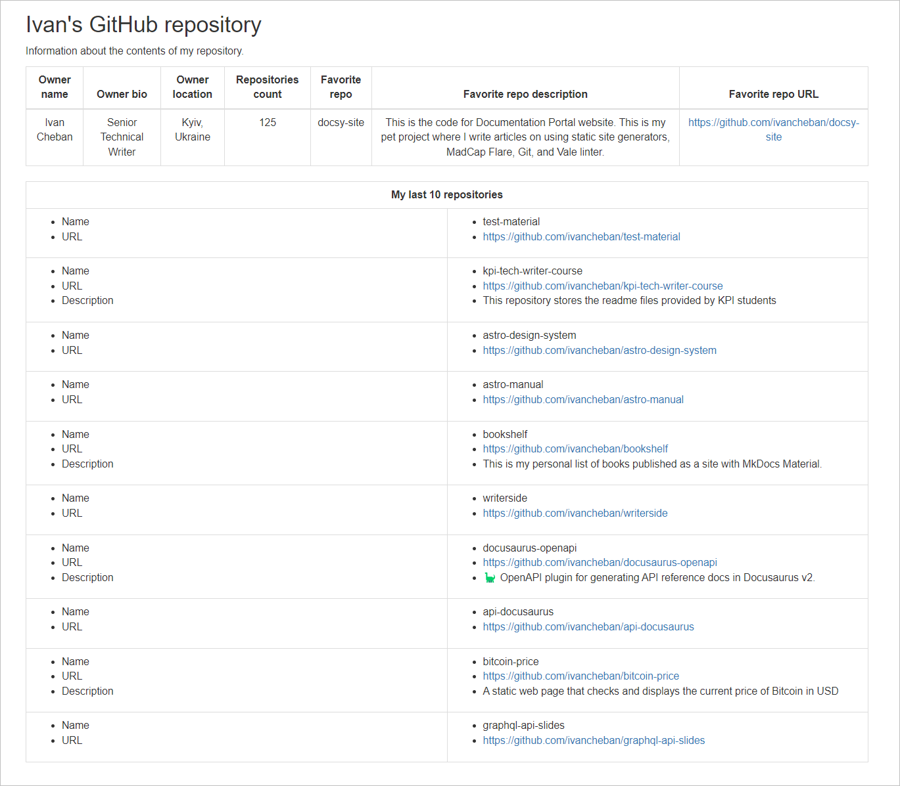

+++
outputs = ["Reveal"]
title = "Create online presentations with Hugo"
+++

## GraphQL API Docs

---

* What's GraphQL API and how's it different from REST API?
* Who uses GraphQL API?
* What are tools for documenting GraphQL API?
* GraphQL query example
* Handlebars.js HTML template
* Where can I find more about GraphQL API?

---

## What's GraphQL API and how's it different from REST API?

---

**GraphQL API** and **REST API** are two different approaches to designing APIs for exchanging data over the internet.

---

**GraphQL API**:

- GraphQL APIs get all the data your app needs in a single request.
- GraphQL APIs are organized in terms of types and fields, not endpoints.
- You can add new fields and types to your GraphQL API without impacting existing queries.

---

**REST API**:
- REST enables client applications to exchange data with a server using HTTP verbs.
- REST APIs require loading from multiple URLs.
- REST APIs use HTTP methods such as GET, POST, PUT, and DELETE to perform operations on resources that typically return a fixed data structure.

---

**Differences between GraphQL API and REST API**:
- GraphQL operates over a single endpoint using HTTP, whereas REST development has been more focused on making new APIs.
- In GraphQL, you can send queries or mutations through a single endpoint compared to resource-specific endpoints in REST APIs.

---

## Who uses GraphQL API?

---

* As of 2024, over 27,085 companies worldwide have started using GraphQL as an API Management tool.
* The actual number might be higher as not all companies publicly disclose their tech stacks. Some notable companies that use GraphQL include Facebook, Shopify, and Instagram.

---

## What are tools for documenting GraphQL API?

---

* GraphiQL is an in-browser tool for writing, validating, and testing GraphQL queries.

<div class="graphiqlVid"> <video autoplay="" loop="" playsinline=""><source src="https://graphql.org/img/graphiql.mp4?x" type="video/mp4"></video></div>

https://graphql.org/img/graphiql.mp4?x

---

## GraphQL query example

---

This is an example of a query in GitHub:

```graphql
{
  viewer {
    name
    bio
    location
    repositories {
      totalCount
    }
    repository(name: "docsy-site") {
      name
      description
      url
      collaborators {
        nodes {
          name
        }
      }
      updatedAt
    }
  }
}
```

---

The response to the query:

```json
{
  "data": {
    "viewer": {
      "name": "Ivan Cheban",
      "bio": "Senior Technical Writer",
      "location": "Kyiv, Ukraine",
      "repositories": {
        "totalCount": 126
      },
      "repository": {
        "name": "docsy-site",
        "description": "This is the code for Documentation Portal website. This is my pet project where I write articles on using static site generators, MadCap Flare, Git, and Vale linter.",
        "url": "https://github.com/ivancheban/docsy-site",
        "collaborators": {
          "nodes": [
            {
              "name": "Ivan Cheban"
            }
          ]
        },
        "updatedAt": "2024-01-25T16:02:33Z"
      }
    }
  }
}
```

---

## Handlebars.js HTML template

---

* You can use Handlebars.js to show the JSON response in a visually compelling form.
* https://handlebarsjs.com/examples/builtin-helper-with-block-param.html
* Build the HTML template

---

## Example of Handlebars template

---

```html
<!DOCTYPE html>
<html lang="en">

<head>
    <meta charset="utf-8" />
    <meta name="viewport" content="width=device-width, initial-scale=1" />
    <link rel="stylesheet" href="https://maxcdn.bootstrapcdn.com/bootstrap/3.4.1/css/bootstrap.min.css" />
    <script src="https://ajax.googleapis.com/ajax/libs/jquery/3.6.0/jquery.min.js"></script>
    <script src="https://maxcdn.bootstrapcdn.com/bootstrap/3.4.1/js/bootstrap.min.js"></script>
</head>
<div class="container">
    <h2>Ivan's GitHub repository</h2>
    <p>Information about the contents of my repository.</p>
    <table class="table table-bordered">
        <thead>
            <tr>
                <th style="text-align: center;">Owner name</th>
                <th style="text-align: center;">Owner bio</th>
                <th style="text-align: center;">Owner location</th>
                <th style="text-align: center;">Repositories count</th>
                <th style="text-align: center;">Favorite repo</th>
                <th style="text-align: center;">Favorite repo description</th>
                <th style="text-align: center;">Favorite repo URL</th>
            </tr>
        </thead>
        <tbody>
            <tr>
                <td style="text-align: center;">{{this.viewer.name}}</td>
                <td style="text-align: center;">{{this.viewer.bio}}</td>
                <td style="text-align: center;">{{this.viewer.location}}</td>
                <td style="text-align: center;">{{this.viewer.repositories.totalCount}}</td>
                <td style="text-align: center;">{{this.viewer.repository.name}}</td>
                <td style="text-align: center;">{{this.viewer.repository.description}}</td>
                <td style="text-align: center;"><a href="{{this.viewer.repository.url}}">{{this.viewer.repository.url}}</a></td>
            </tr>
        </tbody>
    </table>
</div>

</html>
```

---

The resulting HTML output:



---

## Where can I find more about GraphQL API?

---

* I passed this course on LinkedIn Learning: https://www.linkedin.com/learning/learning-graphql-11292553/an-introduction-to-graphql?u=2113185
* Official GraphQL website: https://graphql.org/learn/
* GitHub GraphiQL Explorer: https://docs.github.com/en/graphql/overview/explorer
* GitLab GraphQL Explorer: https://gitlab.com/-/graphql-explorer

---

